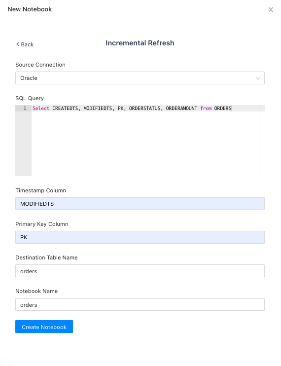

# Templates
CueLake has the following in-built templates.

## Incremental Refresh
Incremental Refresh template fetches incremental data from your source database and upserts it into the destination table in S3. It creates the destination table, if it doesn't exist.

Say you want to sync ORDERS table to S3. Instead of syncing all the columns in the table, you want to sync a few columns only. Below is a sample query. 

```
Select CREATEDTS, MODIFIEDTS, PK, ORDERSTATUS, ORDERAMOUNT
from ORDERS
```

Whenever a row is updated in the ORDERS table in the source database, `MODIFIEDTS` is also updated. `PK` is the primary key of ORDERS table.



When you run this notebook for the first time, CueLake will fetch the entire data and create the S3 table in the specified path. On the next run, only the incremental rows will be fetched and upserted into the S3 table. CueLake uses Iceberg's `merge into` query to merge the data.

## Full Refresh
Full Refresh template fetches all the data from your source database and overwrites the destination table in S3. It creates the destination table, if it doesn't exist.

## Blank
Blank template opens a blank Zeppelin notebook.
