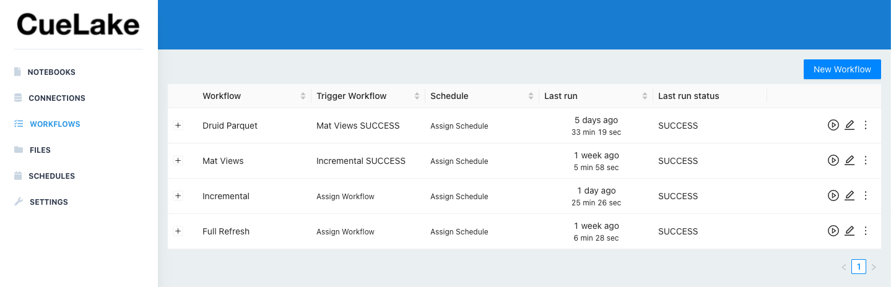
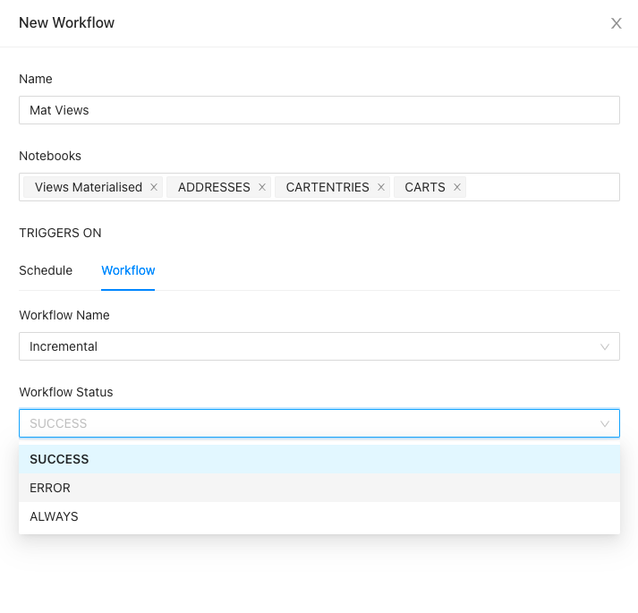

# Workflows
You add one or more notebooks to a **Workflow**. When you run a workflow, it's notebooks run in parallel.

## Trigger Workflow
You can trigger a workflow as per a schedule or after another workflow.

When you trigger a workflow after another workflow, you can trigger it on SUCCESS or ERROR or ALWAYS.

